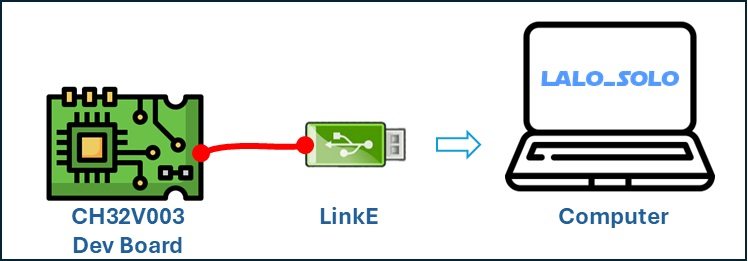
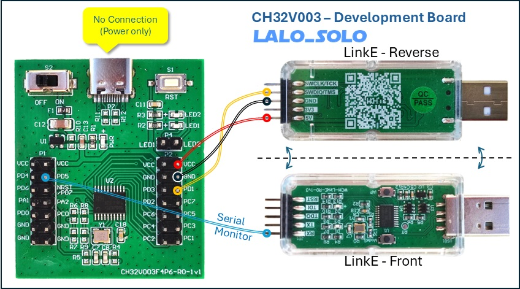
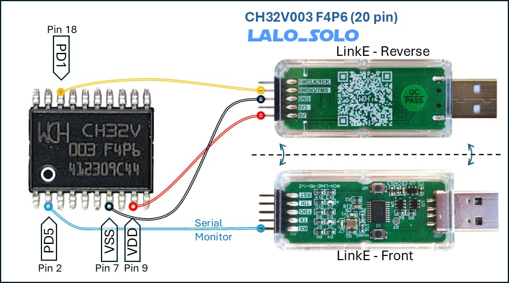
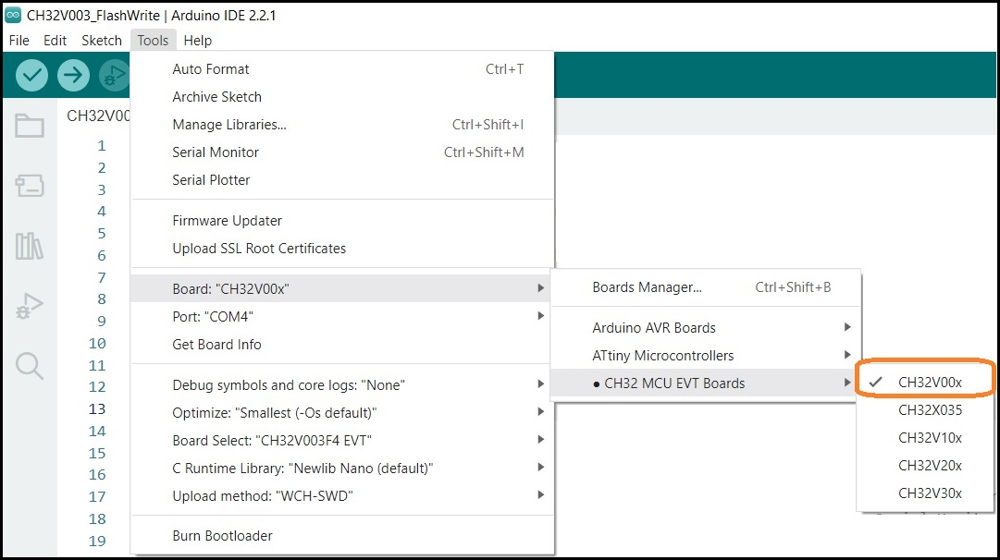
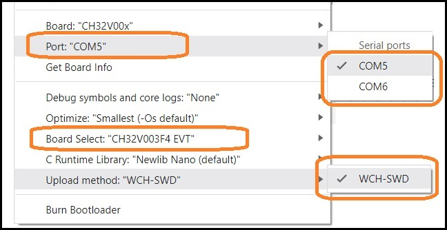
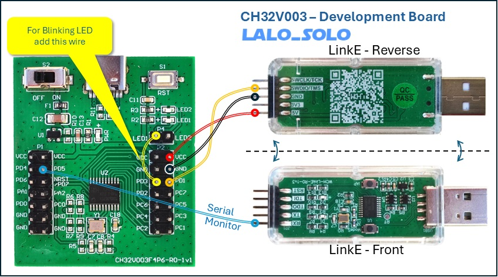

# CH32V003-Arduino-Setup
Instructions to setup Arduino to code for CH32V003 microcontroller

# Context
Since the release of libraries to code for Microchips from **WCH** (https://www.wch-ic.com/) on Arduino IDE, popularity of the MCU has increased, however that doesn't mean that all the power of the microchip is fully available seamless as any Arduino board.

# Prerequisites
For this example to work the following it is needed:
1. A recent version of Arduino IDE installed (2.2.0 or newer).
2. Arduino core support for CH32 EVT Boards (version 1.0.4 or newer)
3. A development board for the CH32V003 MCU (a protoboard version could work as well)
4. WCH-LinkE Programmer to load code into the MCU.
5. It is also recommended to have some wires (DuPount are the recommended ones).

This site won't explain how to install Arduino IDE nor the library for CH32 EVT boards, since instructions are publicly available.

# Hardware Setup
Connections are very simple; the key is to have available all prerequisites listed above.

The **Development Board** is the recommended way to learn and develop code for this MCU.



## Attaching the LinkE Programmer
First, connect the LinkE to the chip depending on your own available hardware.

Follow this diagram with some DuPont wires.




## Attaching the chip
Of course, it is not possible to attach anything directly to the chip, however, it's good to know how it would be done if that was possible.



After the connections are done, the final connection is the LinkE to the computer, that should be the last step to prevent any short-circuit on the USB port.

# Configure Arduino IDE
In Arduino, there should be an indication to the IDE about the board being used.
That is made from the menu "Tools" and following through menus as seen in the image.



COM port might be different on each computer, since it's assigned by the operating system based on its own rules.



If menus are not available as seen in the image, this means that the `core support` for CH32 EVT Boards is missing and must be installed first.


# The Blinking example
The first program for hardware, equivalent to "Hello World" for software is the `blinking` sketch, however, while working with CH32 EVT boards, the code is a little different, particularly on what it refers to pin assignment.
The following code should be enough to blink an LED, which, in the case of the Development Board, is already installed, and ready to be used, but as opposed to Arduino boards, it is not directly connected to any pin, so it must be manually connected.

Just copy and paste into your Arduino IDE, or download the sketch (code) from this repository:

```
#define LED_PIN D13          // PD3, Pin 20

void setup() {
  pinMode(LED_PIN, OUTPUT);
}

void loop() {
  digitalWrite(LED_PIN, HIGH);
  delay(500);
  digitalWrite(LED_PIN, LOW);
  delay(500);
}
```

Of course, some adjustment is needed to see the effect of the LED actually blinking, just add a wire to enable it on the development board.




# Download Links
* **Arduino** IDE: https://www.arduino.cc/en/software
* **Library** support for CH32 EVT boards on Arduino: https://github.com/openwch/arduino_core_ch32
* CH32V003 product **documentation**: https://www.wch-ic.com/products/CH32V003.html


